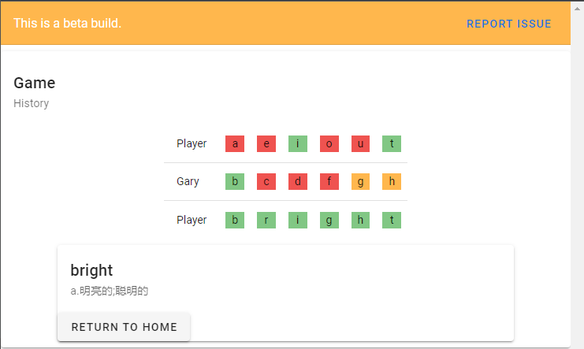

# Guess Words 4ji

This project is inspired by Wordle. 
## Deployed on [heroku](https://guess-words.herokuapp.com/).

## What is this?
This project is a multiplayer version of Wordle. All the words are from [CET-4](https://github.com/cuttlin/Vocabulary-of-CET-4). 

## Instruction
1. To start, put down a unique room id and click 'Create Room'.
2. The other player(s) enter the same room id and click 'Join Room'.
3. Click on 'Start' once every one is in the waiting room
4. Enjoy!

## Future Updates

- ~~Use WebSocket instead of http-requests~~
- Support WebRTC(?)
- Support Random match making
- Support Custom words
- Support Horizontal Scaling